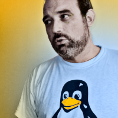

# Artículos

##  Artículos

## [Shiny](shiny.md)

 Desarrollo de aplicaciones Web con R

## [Mejoras en gimp](mejoras-en-gimp.md)

Como dijo Bertrand Russell, "la matemática posee no sólo verdad, sino también belleza suprema" y es que, cuando las fórmulas no son hermosas, son simplemente cuentas.

## [Entrevista a Richard Stallman](entrevista-a-richard-stallman.md)

De nuestra filosofía depende nuestro futuro - Richard Stallman

## [Glitch: la fusión del arte y la tecnología](glitch-la-fusion-del-arte-y-la-tecnologia.md)

Imprevistos en el mundo digital

## [Cuando tomo el café con \(con\)ciencia](cuando-tomo-el-cafe-con-con-ciencia.md)

Repaso a las aplicaciones que uso un día normal de trabajo.

##  [Edición profesional de audio con Linux​ - Laboratorio de música](mixxx-o-como-convertir-tu-ordenador-en-una-mesa-de-dj.md)

Mixxx o cómo convertir tu ordenador en una mesa de DJ… ¡y más!

## [Laboratorio Android](termux-un-terminal-para-gobernarlos-a-todos.md)

Termux: Un terminal para gobernarlos a todos

## [Colectivos que difunden la cultura libre, MeLiSa](colectivo-que-difunde-la-cultura-libre-melisa.md)

Serie de artículos para dar a conocer a individuos y colectivos, que ayudan en la difusión o colaboran de forma significativa en la cultura libre. En esta ocasión, entrevistamos a Rafael Rodríguez Gaioso, presidente de la Asociación Melisa.

## [Dibujos y poemas libres](dibujos-y-poemas-libres.md)

Dibujos y poemas liberados por la autora bajo licencias libres Creative Commons

## [Fotografías libres](fotografias-libres.md)​

Fotos liberadas por el autor bajo licencias libres Creative Commons

## [Colaboradores](colaboradores.md)

