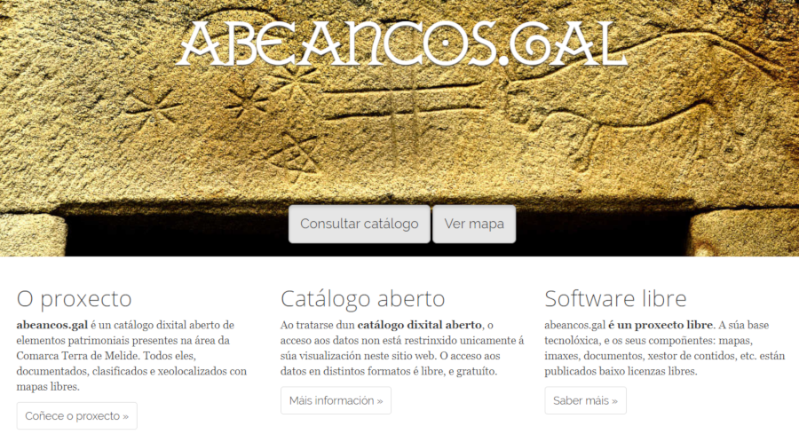
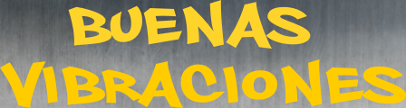
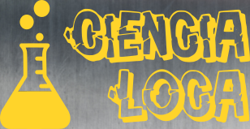

# Colectivos que difunden la cultura libre, MeLiSa

## Colectivos que difunden la cultura libre, MeLiSa

Entrevista para Generación Ñu, realizada por Jorge Lama \(@raivenra\) a Rafa Gaioso, presidente de Melisa:

### [Pulsa aquí para escuchar el audio en formato mp3](https://ia601504.us.archive.org/5/items/EntrevistaARafaGaioso/Entrevista%20a%20Rafa%20Gaioso.mp3)

### [Pulsa aquí para escuchar el audio en formato ogg](https://ia801504.us.archive.org/5/items/EntrevistaARafaGaioso/Entrevista%20a%20Rafa%20Gaioso.ogg)

Web de Melisa: [http://www.melisa.gal/](http://www.melisa.gal/)  
Correo de Melisa: info@melisa.gal  
Música: Álbum Creative Commons Vol. 5 Compositor: Dexter Britain  
Música bajo licencia Creative Commons BY-SA-NC.

Los contenidos de este podcast, están también bajo licencia libre Creative Commons BY-SA-NC.

Alguno de los proyectos mencionados de Melisa:

### Abeancos - Catálogo digital de patrimonio

\*\*\*\*[**abeancos.gal**](https://www.abeancos.gal/) es un catálogo digital abierto de elementos patrimoniales presentes en el área de la Comarca Terra de Melide. Todos ellos, documentados, clasificados y geolocalizados con mapas libres.

### Proyecto de Podcasting en Centros penitenciarios gallegos

Melisa está colaborando con otras asociaciones e instituciones \([Aliad-Ultreia](http://www.aliad.org/), Centro Penitenciario de Monterroso\) en este proyecto de podcasting, sacando adelante y produciendo varios programas elaborados y grabados en el Centro Penitenciario de Monterroso:

**Buenas vibraciones** - Programa de música brasileira y música electrónica.  
iVoox: [https://www.ivoox.com/podcast-buenas-vibraciones\_sq\_f1617514\_1.html](https://www.ivoox.com/podcast-buenas-vibraciones_sq_f1617514_1.html)  
Spotify: [https://open.spotify.com/show/6XJaVrOFwv9tDl1wxKfWgp](https://open.spotify.com/show/6XJaVrOFwv9tDl1wxKfWgp)

**El perímetro** - Programa de música hip hop.  
iVoox: [https://www.ivoox.com/podcast-perimetro\_sq\_f1617516\_1.html](https://www.ivoox.com/podcast-perimetro_sq_f1617516_1.html)  
Spotify: [https://open.spotify.com/show/01zLS5T7E0DlB59dtJ0wE4](https://open.spotify.com/show/01zLS5T7E0DlB59dtJ0wE4)

**Ciencia loca** - Programa sobre divulgación científica.  
iVoox: [https://www.ivoox.com/podcast-ciencia-loca\_sq\_f1617515\_1.html](https://www.ivoox.com/podcast-ciencia-loca_sq_f1617515_1.html)  
Spotify: [https://open.spotify.com/show/0pFpXhSDTP2](https://open.spotify.com/show/0pFpXhSDTP23DutApTLnTT)

### Proyecto de Software Libre en Centros Penitenciarios

En el marco de la I Jornada de Buenas Prácticas en Software Libre para ONGs y Entidades de Acción Social, Rafael Rodríguez Gayoso relata la experiencia de Melisa sobre el voluntariado con software libre en los centros penitenciarios de Galicia.

Vídeo de la charla:  
[https://www.youtube.com/watch?time\_continue=18&v=CWxbVzYuFj0](https://www.youtube.com/watch?time_continue=18&v=CWxbVzYuFj0)

 

