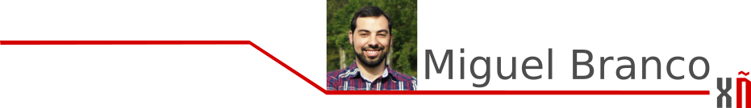
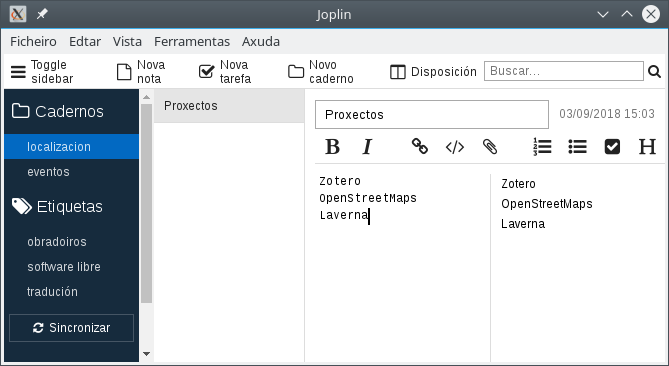
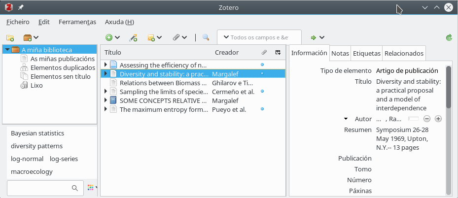

# Cuando tomo el café con \(con\)ciencia

## Cuando tomo el café con \(con\)ciencia


Cuando me levanto por la mañana, un día laborable \(si es el caso, porque me dedico a la ciencia\) me pongo a preparar con conciencia el café, de eses de buen aroma que solo se dan encontrado en tiendas portuguesas. No, no es nuestro caso. Según lo que necesite me lío con unas coas u otras mientras lo preparo. Pero eso si, lo raro es que no vaya mirando a pocos aquellas notas que fui apuntando ayer en una de esas aplicaciones par móvil, de esas que se bajan del [F-Droid](https://f-droid.org/). "Urge, llama a mengano ya!".

Cuando ya tengo mi café preparado en la taza le doy a encender el ordenador, me siento y me tomo con más seriedad la jornada. Lo primero que toca revisar siempre es el correo con [KMail](https://www.kde.org/applications/internet/kmail/) \(si, es que soy de esos aficionados a [KDE](https://www.kde.org/plasma-desktop) desde tiempos inmemoriales\). Lo malo que tiene leer el correo es que siempre aparecerán nuevas tareas, de esas menores e "interesantes" ideas... pero que que al final de la jornada solo suman.

Al verlas \(tomo aire y...\) las añado dentro de nuevos proyectos de mi \(amplio?\) diario, uno que gestiono con [Laverna](https://laverna.cc/). "Para fulano: betapart::beta.temp con la serie 1990-1992", y etc. \(Nota: si, [Joplin](https://joplin.cozic.net/) es también una buena opción, en especial si te gusta [Nextcloud](https://nextcloud.com/)\).

Ahí es cuando toca ya ponerse a trabajar de lleno. O bien necesito obtener información que está publicada en repositorios públicos, como Figshare o Genebank, o bien toca hacer uso de [R](https://www.r-project.org/) y [Bioconductor](https://bioconductor.org/), en IDEs como [RStudio](https://www.rstudio.com/) o [RKward](https://rkward.kde.org/), y hacer una limpieza y análisis de datos. Seguramente lo que también necesite es crear algún informe con [RMarkdown](https://rmarkdown.rstudio.com/) y estudiar los resultados.

Bien, pues es así como me entretengo a lo largo de mis jornadas. Eso sí, siempre con el café al lado en una de esas tazas con humor \(of course!\).

Lo que tengo que reconocer es que los días que más me cuestan son aquellos en los que toca escribir. Es que, el arte de escribir se gana leyendo mucho y con su tiempo de reflexión. Cuanto más se lee de un tema científico, más se aprecia que aquellas frases que parecen simples se pueden comprender de cientos de maneras, o incluso sin querer introducen un nuevo concepto \(ahora, en general lo que se introducen son errores\).

A lo que iba, ¡que Haeckel y Darwin bendigan a los gestores de bibliografía! “¿Cuál era ese artículo de los 1960 que hablaba precisamente de esto, de la sucesión de plancton? ¿Y aquel artículo de Fisher de distribución de especies era de 1942 o de más tarde? ¿Y cómo los cito aquí?..."

Pues ahí está lo práctico que es [Zotero](https://www.zotero.org/) cuando uno se dedica a leer o escribir. ¡Qué gusto da guardar artículos desde el navegador, tenerlos clasificados por temáticas, exportar listas de referencias y tener copias de seguridad en la nube! Seguramente la mayor ventaja sea poder exportar colecciones de bibliografía y usarlas al escribir. Lo que hago es exportar las referencias en bibtex y ponerme a redactar los artículos científicos en LaTeX con [TexMaker](http://www.xm1math.net/texmaker) o en Markdown con [Atom](https://atom.io/). ¡Y ya está! en mi documento final me aparecen todos los autores y autoras en cada una de sus frases que les toca, sin tener que editar cada cita a mano.

¿Que me han rechazado un artículo en una revista y quiero cambiar el estilo de edición para otra? o ¿quiero preparar ese documento en otro formato? Pues lo hago en tiempo récord y sin problema: en el peor de los casos siempre está [pandoc](https://pandoc.org/). Dije esos editores gráficos porque los uso, pero para aquellos devotos de [LibreOffice](https://www.libreoffice.org/) que sepan que tienen una [extensión de Zotero](https://extensions.libreoffice.org/extensions/zotero-libreoffice-integration).

Y así discurre mi jornada, borrando y añadiendo tareas de la lista. Y si, ¡siempre cerca de un café y usando software libre! De hecho, ahora mismo no me viene a la mente una aplicación que esté obligado a usar y no tenga una licencia libre. Algunas veces las editoriales exigen envíos en formatos de documento cerrados cuando se les envía la publicación a la revista, o algunos compañeros se acomodan con lenguajes de programación privativos como MATLAB \(porque la compañera del compañero de laboratorio que me enseñó lo aprendió en un laboratorio de Maine cuando había estado allí en el año 2000\). Aún así, pandoc está ahí y lenguajes como [Octave](https://www.gnu.org/software/octave), [Python](https://www.python.org/) o [Julia](https://julialang.org/) también.

Ahora bien, ese software, que es libre y uso día a día en ciencia, tiene algo más para mi. Ese software está traducido, y si, muchas veces a mi lengua, el gallego. Algunos traductores \([trasniños](http://trasno.gal/) o no\) quisieron \(quisimos\) traducirlos y lo hicieron. Si alguien quiere usar Joplin, TexMaker o RKWard con acento del noroeste, ya puede.Tendría que revisarlo, pero posiblemente incluso lo tenga con acento asturleonés.

Ahora bien, hay algún software que -aún- no lo está, solo tiene acento anglosajón. Pero la cuestión es ponerse a ello. Lo que hay que hacer es anotarlo en la lista de tareas pendientes, preparar un buen café, sentarse y ¡ponerse a trabajar! \(Solo\) si es software libre, siempre se podrá traducir a nuestro idioma.

