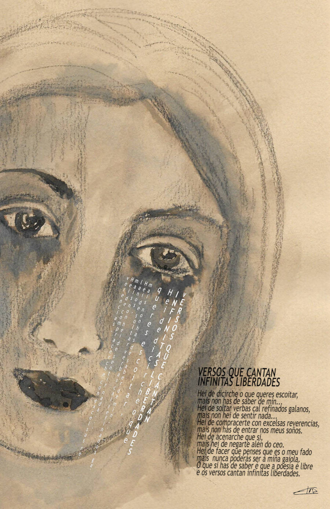

# Dibujos y poemas libres

## Dibujos y poemas libres

### Poema en formato audio

### [Pulsa aquí para escuchar la grabación del poema](https://youtu.be/qw3JM3t8cfY?t=45)

### Dibujo con el poema

Música utilizada: When You Leave del autor Sergey Cheremisinov con licencia Creative Commons BY  
[http://freemusicarchive.org/music/Sergey\_Cheremisinov/Charms/Sergey\_Cheremisinov\_-\_Charms\_-\_04\_When\_You\_Leave](http://freemusicarchive.org/music/Sergey_Cheremisinov/Charms/Sergey_Cheremisinov_-_Charms_-_04_When_You_Leave)  
La grabación del poema está licenciada bajo licencia Creative Commons BY - SA 4.0  

### Ficha técnica

AUTOR: Elsa Martínez  
TÍTULO: Chorando versos  
TÉCNICA: Dibujo a tinta y lapiz  
FECHA: 2018  
\*El poema “Versos que cantan infinitas liberdades” es un canto a los derechos y libertades de todas las mujeres. No estamos solas y nuestras voces deben y tienen que ser escuchadas.

