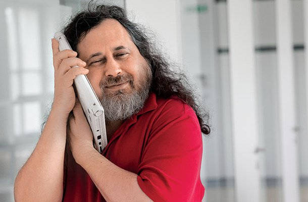

# Entrevista a Richard Stallman

## Entrevista a Richard Stallman

De nuestra filosofía depende nuestro futuro - Richard Stallman [Wikiquotes](https://es.wikiquote.org/wiki/Richard_Stallman)

### **¿La filosofía del software libre podría aplicarse a cualquier  empresa, gestión de equipos o comunidades siguiendo la etimología del término Ubuntu?**

Creo que no es aplicable en esos campos. La filosofía del movimiento software libre es que un programa, cualquier programa, debe respetar la libertad y la comunidad de los usuarios. Para hacerlo, debe ofrecerles las cuatro libertades esenciales. \(Véase [Philosophy](https://gnu.org/philosophy/free-sw.es.html)\). Si el programa no las respeta es un instrumento del poder injusto de su dueño. Nuestra lucha es para poner fin a esta injusticia. Esta cuestión se plantea para un programa porque el programa, según cómo se distribuya a los usuarios, o respeta su libertad o les priva de su libertad. Se plantea para un programa como consecuencia de la estructura del asunto. Muchos otros asuntos importantes tienen otra estructura, entonces la misma cuestión no se plantea.

Ubuntu no debería ser nuestro ideal. Es una distribución del sistema operativo GNU con Linux, pero presenta problemas éticos. Su nombre significa "ayuda mutua", creo recordar -- un valor admirable pero que no alude en absoluto a la libertad. No ha de sorprender, entonces, que la distro Ubuntu no es libre. Ubuntu instala programas privativos sin consultar ni informar al usuario. Luego le invita a instalar otros programas privativos; llama "free" \(en vez de «gratis»\) a los que son gratuitos, sembrando así más confusión. Los desarrolladores de Ubuntu no plantean asuntos de libertad. No plantean ningún asunto ético, sino que sólo dicen que intentan ofrecer "la mejor experiencia al usuario." A todos los niveles, nos niegan su apoyo porque no están de acuerdo con nuestra filosofía. Ubuntu nunca cita software libre, sino "código abierto", que es otra idea basada en otros valores. Véase [Philosophy 1](https://gnu.org/philosophy/open-source-misses-the-point.es.html). Hay distribuciones 100% de software libre, desarrolladas por gente que valora la libertad, pero Ubuntu no es una de esas. Véase gnu.org/distros.

### **Conociendo las ventajas del software libre,  ¿Si el software libre es la opción más justa y ética por qué hay tanto recelo en utilizarlo en nuestro entorno, en la educación ,  etc?**

Para mí la palabra "ventajas" no es adecuada para referirse a la importancia de los derechos humanos. Los desarrolladores de los programas privativos lo más conocidos disponen de mucho dinero. Pueden introducir funcionalidades cómodas para distraer a los usuarios del asunto de su libertad. Pueden pagar sobornos. Pueden hacer presiones políticas y publicidad.

En el caso de Múnich, Microsoft convenció al ayuntamiento a migrar de GNU/Linux a Windows en cambio de la mudanza de la sede europea de Microsoft a Múnich. Esa mudanza tuvo el efecto de un soborno de Microsoft a Múnich, porque los impuestos de la sede ahora van al ayuntamiento de Múnich. Pagar un soborno a un político es un delito, pero un soborno a una administración, aunque igual de corrupto, es legal.

Un programa privativo somete a sus usuarios al poder de su dueño, quien suele usar su poder para llevar a los usuarios adonde él quiere. Pueden armar trampas que dificultan cambiar por otro programa, por ejemplo la incompatibilidad deliberada. Entonces el esfuerzo de cambiar por software libre es una inversión en tu futuro libre y en el futuro libre de la sociedad entera.

### **¿Big data o thick data?**

No hago la diferencia pero sólo puede ser un asunto secundario. Recoger tantos datos personales como se recogen hoy pone en peligro los derechos humanos. La nueva GDPR de la UE es insuficiente. Tenemos que prohibir por ley que los sistemas sean diseñados para seguir y husmear a la gente.

### **¿Qué opinas de las iniciativas que se dedican a que los usuarios puedan elegir los datos que desean compartir con las empresas mediante un sistema blockchain y siguiendo unos principios...?**

No puede ser adecuado. Una vez acumulada, cualquier base de datos será un abuso. Entonces, el único camino adecuado para protegernos del rastreo y husmeo digitales es diseñar todos los sistemas para no recoger datos. En muchos países la policía pone cámaras en las calles, pueden mirar a todos. Comienzan a conectarlas a sistemas de reconocimiento de caras para hacer historiales de los movimientos de cada uno.

Mucha gente se permiten rastrear sin utilizar cámaras: un teléfono móvil siempre dice a la red dónde está, y la empresa de telefonía toma nota y guarda los datos por meses o años \(según qué país\). El teléfono móvil también puede ser convertido a distancia en un dispositivo de escucha, que escucha siempre, sin parar \(excepto cuando su pila se ha descargado\). Quince años atrás pensé en la posibilidad de adquirir un teléfono móvil, entonces investigué sobre sus posibles injusticias y descubrí estas. Por revulsión decidí no llevar ninguno. Véase [Malware](https://gnu.org/malware/malware-mobiles.html).

### **¿Realmente hay algún modo de salvar nuestros datos?**

Creo que la idea de "salvar nuestros datos" es un mal camino, no puede ser adecuado para proteger nuestra privacidad. Una vez recogidos, los datos serán usados para maltratarnos y amenazarnos. Véase [Surveillance vs. Democracy](https://gnu.org/philosophy/surveillance-vs-democracy.es.html). Por lo tanto hay que evitar la acumulación de datos.

### **¿Sigue siendo la universidad la que tiene el papel más destacado en el desarrollo del software libre?¿Es posible hacer rentable y sostenible una empresa que desarrolle herramientas de este tipo?**

Creo que hoy en día las empresas desarrollan tanto software libre como las universidades, y los voluntarios independientes quizás más aún. Pero estudiar las estadísticas del software libre no es mi misión. Mi misión es concienciar a la gente acerca de cómo los programas privativos son una injusticia. [Philosophy 2](https://gnu.org/philosophy/free-software-even-more-important.es.html) y suelen ser diseñados para espiar, restringir y dañar a la gente [Malware](https://gnu.org/malware/), lo que es otra injusticia.

### **¿Por qué las grandes multinacionales están invirtiendo en software  libre como parte de su cuota de mercado?**

A veces sirve los objetivos de una empresa grande que un programa libre esté disponible. Quizás facilita el uso de algún producto o servicio, por lo que fomenta su compra. Sean cual sean tus motivos, nos alegra tu contribución a nuestra mundo libre. No estamos en contra del negocio ni de la ganancia. Sólo estamos en contra del software que somete a los usuarios.

1. \*\*¿Consideras que faltan herramientas crowdsourcing que potencien

    licencias libres?\*\*

Hay plataformas de crowdfunding \(no son herramientas sino sitios web\) que funcionan para proyectos de software libre. La mayoría tienen la falla ética de que donar dinero requiera ejecutar programas privativos. Es decir que para donar a un proyecto, que sea de software o no, tendrías que ejecutar unos programas privativos que las páginas web transmiten a tu navegador. No debemos llevar a nadie a usar un programa privativo, entonces no debemos publicitar los proyectos que usan dichas plataformas. Es un problema muy grave en los sistemas actuales de pago. Buscamos a voluntarios para desarrollar programas libres para donar dinero a esos proyectos.

### **Las humanidades digitales, por ejemplo, a la hora de gestionar contenidos...** 

Cuándo dice "contenidos", ¿se trata de las obras publicadas? Llamarlas "contenidos" las desprecia, sugiere que su valor no es sino llenar algún contenedor. [Words to avoid](https://gnu.org/philosophy/words-to-avoid.html#contents). Creo que cada obra tiene su valor, que puede ser artístico o político o funcional u otro, por lo tanto evito despreciarla con el término "contenido". Volviendo a la substancia de la pregunta, no veo ningún problema en las bases de datos de las humanidades digitales, porque son datos acerca de la obras publicadas, no de las personas.

**La pregunta hace referencia a los estándares a la hora de compartir archivos o librerías de datos, ya que al compartir en distintos formato \(la mayoría privativos\) dificulta la continuidad de proyectos y la expansión de la cultura libre.**

La proliferación de formatos privados y secretos, cada uno limitado a un solo programa, es una consecuencia de los programas privativos. Cuando una empresa tiene una aplicación privativa que domina un campo, piensa bloquear el camino de la competencia. Para ello inventa un formato secreto y cambia su aplicación para salvaguardar un proyecto únicamente en ese formato. Para unos ejemplos, véase [Propietary incompatibility](https://gnu.org/proprietary/proprietary-incompatibility.html). La lista no es completa: creo que Microsoft Word, Autocad y un conocido programa de contabilidad han hecho algo parecido. Quizás Adobe también.

El software libre evita por su naturaleza este problema porque lo que hace nunca es secreto. Si un programa libre implementa algún formato, otros desarrolladores, leyendo su código, pueden comprender el formato.

### **Mi pregunta es qué podemos hacer los  humanistas digitales por fomentarlo para no limitar el acceso al  conocimiento, ya que hay muchos intereses creados en lo que se refiere a editoriales y publicaciones científicas.**

Hay formatos de público conocimiento que podemos usar para publicar e intercambiar archivos. Para textos, existen ODT y PDF. Lo que hace falta es presionar a las organizaciones, a las empresas y a la gente para que usen esos formatos. Rehúso intentar conocer el contenido de un archivo de formato .doc, y explico por qué. No hago excepciones.

### **¿Qué se puede hacer para visibilizar a la mujer en el ámbito de las  nuevas tecnologías, como profesionales y desarrolladoras?**

Los argumentos que presento en favor del software libre no dependen del género; creo que tienen la fuerza lógica para poder convencer a personas de cualquier grupo. Entonces, no enfoco grupos; intento convencer a quienquiera que escuche. Hago una conferencia y vengan los que vengan.

Siempre pido a los organizadores de mis conferencias que publiciten el evento en los departamentos de filosofía, derecho, política e historia, no sólo en el de informática. Pero no tengo control de la publicidad que hacen, sólo puedo instar.

Hay una actividad que se llama Outreachy que intenta atraer a mujeres, y a miembros de otros grupos poco representados, a la comunidad de software libre.

