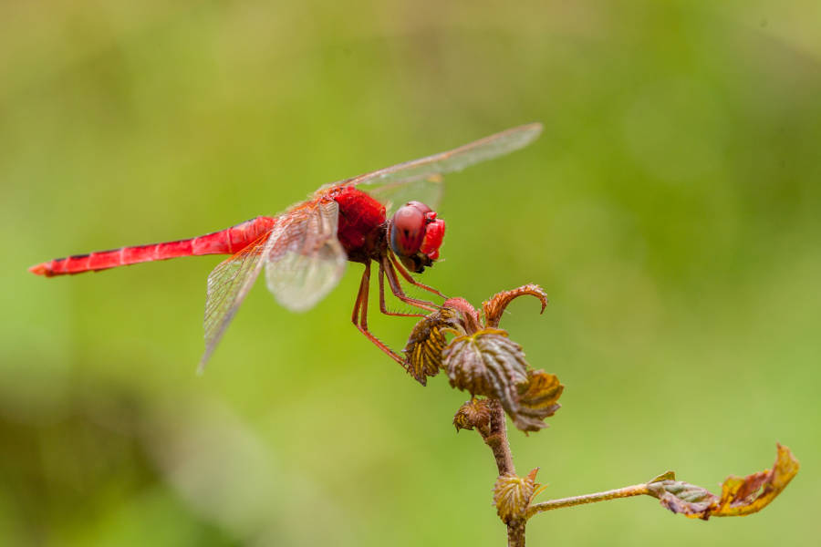
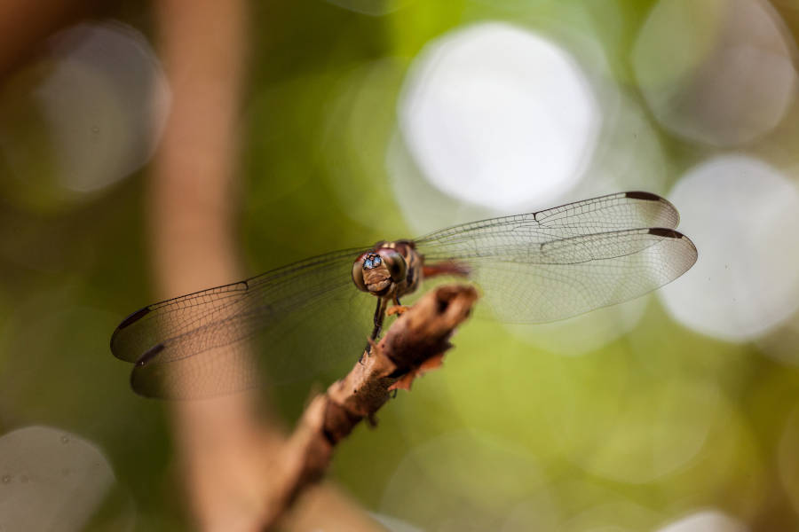

# Fotografías libres

## Fotografías libres

Fotos utilizadas en la portada y contraportada de este número de Generación Ñu:

Perdido en medio de los arrozales de una de las islas del río Mekong de nombre Don Det, en tan hermoso país como es Laos, me encontré esta precioso ejemplar.

Esta es una de las muchas libélulas que te puedes encontrar en Camboya; llama la atención por su tamaño y la variedad de colores.

## Contraportada

