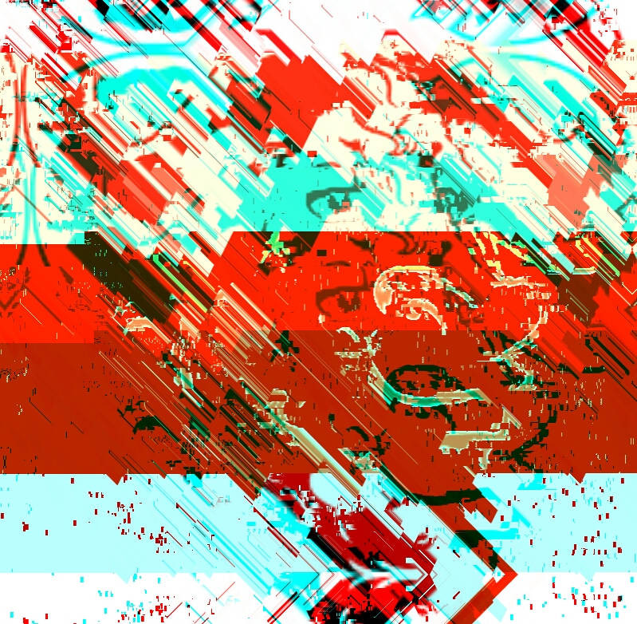

# Glitch: la fusión del arte y la tecnología

## Glitch: la fusión del arte y la tecnología

### ¿Qué es el Glitch?

Cualquier lector/a podría preguntarse qué hay detrás de esta singular palabra acuñada por John Glenn en 1962. Fue el primer astronauta en orbitar la tierra y cuando empleó esta terminología, se refería al pico o cambio de voltaje en una corriente eléctrica.

En el lenguaje informático, la palabra se asocia a un error en el software. No se alude al “bug” sino a un imprevisto o fallo visual inesperado en su funcionamiento. El error, en sentido artístico, es la antesala de la creatividad y de la experimentación porque reúne las características como la improvisación, la comunicación \(análoga a los sistemas de radio y TV\) ya que se trata de una interferencia pura y directa con el entorno que se sintetiza a través del usuario co-creador que o bien los reproduce artificialmente o capta dichas secuencias de forma deliberada “glitcheando” el dispositivo digital para transformarlo en un archivo estable.

La obra que he creado es una representación del Ñu de GNU mediante una técnica de fragmentación y desplazamiento de partes de la imagen original, cambios de tono, donación visual y preplicación como resultado de un entrelazado de píxeles y del código existente debajo de la imagen digital. Siguiendo la tendencia de Takeshi Murata, John Satrom, Iman Moradi o Rosa Menkman, por citar algunos.

En España no hay artistas que exploren o teoricen sobre este ámbito, porque es un arte que nació en los laboratorios de forma autogestionada e independiente. Hay más videoartistas en el territorio hispano que experimentan el glitch a modo de performance utilizando vídeo analógico como una reescritura o reinterpretación que la tecnología hace de sí misma.

> Ej: No signal, no bad \(2007\) o Absbytes \(2006\) de Carlos Trilnick.

Se pone de algún modo la tecnología al límite para lograr una estética específica de la electrónica en la que los bytes se hagan visibles. Los net.artistas juegan con la realidad, alterándola y ofreciendo nuevos recursos para la participación y la reflexión crítica sobre el alcance de internet en términos de comunicabilidad y legitimidad \(spam, suplantación de identidad, bots, etc y sus usos\). Un giro hacia la metatecnología y sus profundidades, en la que las acciones están técnicamente articuladas.

