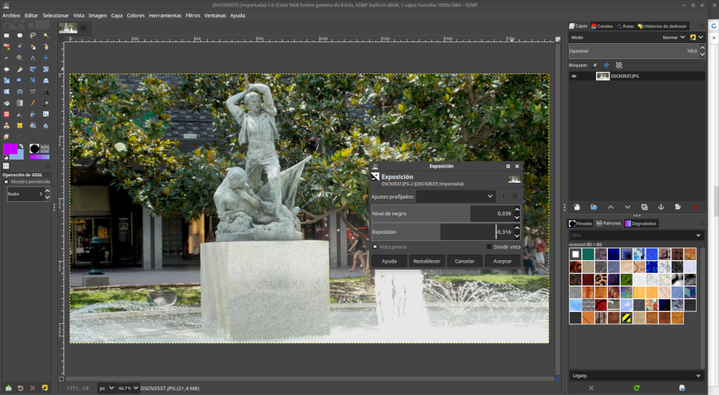
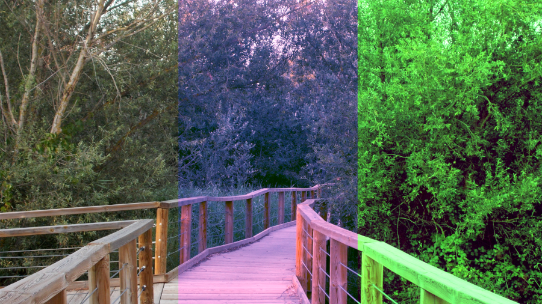
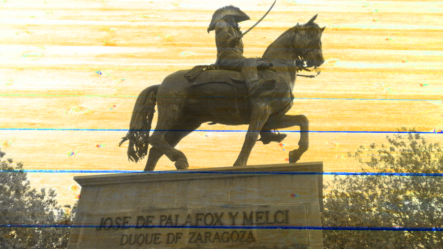

# Mejoras en gimp

## Mejoras en gimp

No soy fotógrafo, soy un técnico que trabaja con fotógrafos. Digo esto porque voy a hablar de GIMP desde un punto de vista más técnico que artístico. Aunque en esencia, arte y ciencia van de la mano. No hay belleza sin matemáticas, ni matemáticas sin belleza.

Como dijo Bertrand Russell, _"la matemática posee no sólo verdad, sino también belleza suprema"_ y es que, cuando las fórmulas no son hermosas, son simplemente cuentas. Y lo que no es bello, suele caer en el olvido. Pero lo elegante y útil sobrevive y evoluciona.

Este es el caso de GIMP. Un programa útil y elegante, tanto para fotógrafos, ilustradores, diseñadores y otras ramas más artísticas como para técnicos, matemáticos o programadores. Por ello sobrevive. Por ello evoluciona. Por ello tenemos **GIMP 2.10**.

Muchas veces me encuentro con un problema al hablar con músicos, con fotógrafos o, especialmente, con directores artísticos, y es que me resulta complicado entender su lenguaje: hacer que un sonido sea **"brillante"**, **"sobreexponer"** una imagen digital o dar un **"look beauty"**. Pero en el sector audiovisual esta es la jerga más usada. Mucho más que hablar de frecuencias, que es el uno de los conceptos que unen a la imagen con el sonido o de los espacios de color y sus canales.

Supongo que los programadores de GIMP se encontrarán con estos problemas. Y, dado que el software libre se debe a la comunidad, **GIMP 2.10 implementa muchas funcionalidades orientada a fotógrafos**.

En el menú Colores, nos encontramos con la herramienta **"Exposición**", con un **balance de blancos automático**. También un concepto que le gusta mucho a los fotógrafos, que es en el menú Filtros / Realzar, está la herramienta de **"Paso alto"**.

Pero también con un montón de herramientas que nos encantan a los que venimos del mundo de **ImageMagick** y nos gusta operar con los colores. Veamos alguna de ellas:

En Colores / Componentes tenemos tanto **"Extraer componente"** como **"Descomponer"**. **Extraer componente permite trabajar únicamente con un canal de un determinado espacio de color**. Es una forma de pasar a escala de grises una imagen según unas determinadas características, como pueda ser si tiene mayor o menor cantidad de uno de los colores primarios o según la luminosidad de la imagen.

**Descomponer, es lo mismo, pero separando en capas los distintos canales**. Por ejemplo, en un espacio de color RGB, lo que hace es separar tres capas: una con la información del rojo, otra con la información del verde y la tercera, con la información del azul.

Una vez separados los canales, podemos trabajarlos individualmente y volver a componer la imagen con Colores / Componentes / Componer. Y lo mejor de todo, es que **GIMP 2.10 no nos permite trabajar únicamente con el espacio de color RGB, sino con doce espacios de color más.**

Esto nos da una mayor precisión a la hora de trabajar con los colores y, sobre todo, nos permite hacer modificaciones puntuales únicamente a un canal.

Otra de las mejoras que aporta GIMP 2.10 respecto a anteriores versiones es la **cantidad de modos de fusión de capas que trae**. Sin añadir ni quitar nada a la instalación por defecto, **38 modos distintos** de combinación de capas, entre las que se incluye el modo borrar y modos que afectan a los canales de distintos espacios de color.

**Color a Alfa, en el menú Colores, permite seleccionar un color, bien con el cuentagotas, bien seleccionando directamente el color en el panel o con el código hexadecimal, que lo transforma en transparente**. A la hora de quitar fondos o eliminar objetos en una imagen facilita mucho la tarea en lugar de tener que hacer recortes, borrar o tener que añadir máscaras.

Pero con las máscaras también hay mejoras, y muchas. No a la hora de aplicar una máscara de capa, que no deja de ser aplicar mayor o menor transparencia dependiendo de la tonalidad de la máscara, sino a la hora de crearlas.

Aparte de la separación de canales que he citado antes, permitiendo un mayor abanico de modalidades de pasar a escala de grises, **GIMP 2.10 cuenta también con otras muchas formas de pasar una imagen a escala de grises**. En Colores / Desaturar tenemos cuatro herramientas muy interesantes: **Color a escala de grises**: herramienta mejorada respecto a anteriores versiones con la posiblidad de trabajar independientemente el ruido, el número de muestras y las iteraciones. **Desaturar**: con cinco modos distintos: **Luminosidad, Luma, Luminosidad \(HSL\), Media \(intensidad HSI\) y Valor \(HSV\)** **Mezclador mono**: básicamente une en una misma herramienta con deslizadores el trabajar con niveles con los tres canales RGB por separado. **Sepia**: que no pasa a escala de grises, pero sirve como paso intermedio.

Como podemos ver, varias de las mejoras que aporta GIMP 2.10 respecto a las versiones anteriores se basan en una **mayor versatilidad a la hora de trabajar con distintos espacios de color e, individualmente, con sus distintos canales.**

Y todo esto, en un entorno amigable, bastante intuitivo y con una nomenclatura que satisface tanto a técnicos como artistas. Y es que, como dijo James Joseph Sylvester, a quien le debemos muchas aportaciones a las matrices, a la combinatoria y muchos otros conceptos matemáticos que usamos día a día en la informática:

"L_as matemáticas son la música de la razón"._

