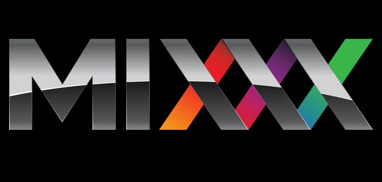
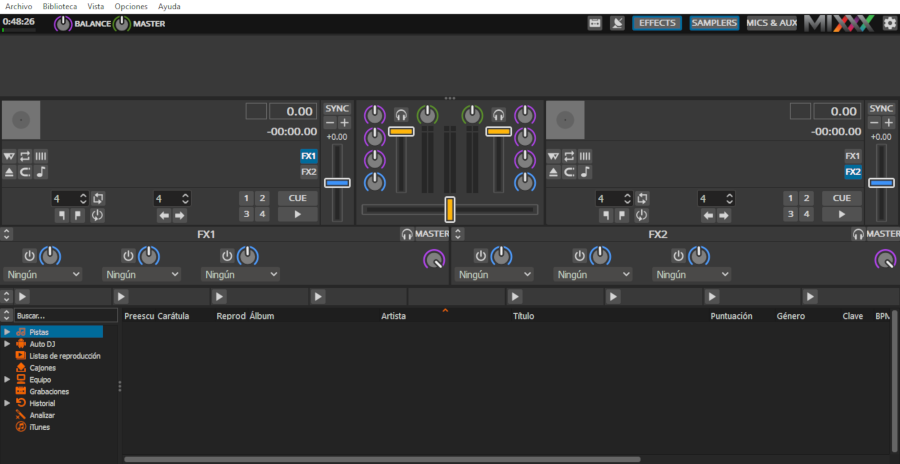
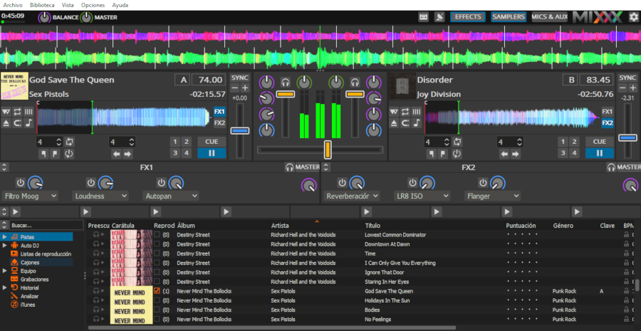

# Mixxx o cómo convertir tu ordenador en una mesa de DJ

## Mixxx o cómo convertir tu ordenador en una mesa de DJ

### Introducción: cómo mezclar libremente

Con el motivo del lanzamiento de su versión 2.1.4 \(lista para su descarga y uso desde el 12 de septiembre\), nos centraremos en esta ocasión en un software que todo DJ-libre que se precie deberá tener en su equipo: Mixxx \([https://www.mixxx.org/](https://www.mixxx.org/)\).

  
Sabemos que, para la mezcla de canciones o listas de reproducción, los DJ’s han de contar con diversos platos o “plataformas de lanzamiento” en las que se cargarán distintas pistas de audio, que podrán ser manipuladas individualmente a través de distintos efectos \(por ejemplo, dando lugar a una reproducción a mayor o menor velocidad, o añadiendo eco a la parte del tema que lo requiera\) o técnicas variadas \(por ejemplo, el scratch, método en el que originalmente los DJ’s arrastraban de forma directa el vinilo que estaba siendo reproducido en uno de los platos, dando lugar a un característico sonido\), de modo que no sólo es original la mezcla y suma de pistas o el modo en el que estas se intercalan, sino que también destaca el resultado sonoro de la mezcla y el modo en el que esta es presentada al público.

Si pretendemos realizar todo esto con un ordenador y software libre, estamos hablando de utilizar el ya mencionado Mixxx.

Con un entorno gráfico práctico y sencillo, si bien con muchas opciones disponibles para su uso, Mixxx adapta al formato virtual una mesa de Dj, con todas las funciones básicas de esta: distintos platos, efectos para cada uno de ellos, una línea temporal para ver el desarrollo de cada una de las pistas, una biblioteca de pistas de audio listas para la mezcla,...

Las opciones se muestran de forma intuitiva para aquellos usuarios principiantes que quieran asimilar tranquilamente el sistema de funcionamiento del programa, pero también serán múltiples y completas las opciones de cara a aquellos expertos en la materia.  
Así mismo, el cursor funcionará como nuestra mano para accionar cada uno de los efectos y clickear en cada una de las opciones, pero también nos permitirá actuar directamente sobre los “vinilos” para no dejar de lado todas aquellas técnicas propias de los Dj’s que escapan del acto de mezclar en sí mismo.

Por último, el programa también es compatible con pantallas táctiles que permitirán usar Mixxx directamente con las manos, manipulando de forma directa la mesa de Dj. De este modo, el usuario tendrá al alcance de su mano todas las herramientas para mezclar libremente.

###  Mixxx en pocas palabras: toma de contacto

Para explicar brevemente el funcionamiento de Mixxx, dividiremos la pantalla y sus opciones en tres fragmentos horizontales. De este modo, el fragmento superior corresponde a lo que llamaremos como “Línea del tiempo y opciones varias”; el fragmento inferior, la “Biblioteca”; y, el intermedio, los “Platos y efectos”. Veamos brevemente las utilidades y posibilidades de cada uno de estos fragmentos.

Comenzando por abajo, el fragmento inferior corresponderá a la “Biblioteca”. En este espacio, podremos cargar o importar las distintas pistas de audio del equipo, que serán clasificadas a través de etiquetas \(autor, portada/imagen, género, etc...\), así como diversas opciones para crear listas de reproducción controladas o aleatorias, buscar determinadas canciones entre todos nuestros archivos o conectarnos a repositorios digitales de audio, como es el caso de iTunes.  
Por así decirlo, desde la “Biblioteca” podremos preparar nuestras armas para la batalla, que una vez seleccionadas, estarán listas para su mezcla.

 El fragmento intermedio, “Platos y efectos” es, definitivamente, el más importante del programa. Aquí controlaremos las distintas pistas de audio que estamos mezclando \(de una a cuatro, como máximo, de forma simultánea\), permitiéndonos controlar los distintos parámetros de cada una de ellas, tales como el minutaje de la reproducción, tempo, volúmenes, marcadores a lo largo de la pista de audio, una barra central para dar más volumen a una mezcla en función de la pérdida de volumen de otra, y otras funciones.

Además, desde aquí podremos aplicar una serie de efectos, ya sea a una pista determinada \(hasta cuatro a la vez\) o a la mezcla en total. En este apartado será, por tanto, donde “sucederá la magia”, donde cada audio o la suma entre audios se verá modificada, producida y reorganizada por nuestra mano.

Finalmente, en la franja superior encontraremos la “Línea del tiempo”, una representación gráfica de la reproducción de cada uno de los audios que podremos manipular \(incluso durante la propia reproducción\), actuando como si de un vinilo se tratase. Igualmente, disponemos aquí de las opciones básicas del programa, tales como el máster o control de volumen y balance general, un reloj para “cuadrar” de forma precisa nuestras mezclas, la opción de grabar y/o realizar streaming de nuestra mezcla o una serie de botones para activar o desactivar los distintos efectos, samplers o periféricos \(por ejemplo, micrófonos\) que estén siendo usados en ese momento.

Mixxx se trata, por tanto, de un programa que, aunque posee ciertas limitaciones en lo relativo a aspectos como la cantidad de efectos, es ideal para aquellos que quieran experimentar el mundo de los DJ’s, dando a los principiantes un programa intuitivo y a través del cuál es fácil aprender a manejarse, y a los expertos una solución desde la perspectiva del software libre que no es para nada despreciable. Es, pues, un software factible e interesante que ha de ser tenido en cuenta para montar nuestro laboratorio de música libre.

###  **Un software... ¿sólo para DJ’s?**

Acabemos rápidamente con la intriga: NO. Mixxx no es sólo para DJ’s, y sus usos son variados y prácticamente ilimitados.

Claramente, el formato y/o entorno gráfico simulan una mesa de Dj, pero no necesariamente se cierran a este tipo de usos. Por ejemplo, observaremos como Mixxx es un interesante reproductor de música, que al margen de la mezcla entre varias pistas nos permitirá crear listas de reproducción \(con la posibilidad de aplicar faders automáticos entre las distintas pistas, de modo que se suavicen las transiciones entre estas\) y aplicar ciertos efectos a las canciones o audios reproducidos, en caso de que lo considerásemos necesario.

Así mismo, el software nos permitirá explorar el sonido y sus capacidades, cargando una o varias pistas de audio que controlaremos y ecualizaremos de distintas maneras con el fin de indagar en las posibilidades sonoras de dichas pistas, o incluso de remasterizar aquellos audios que, bien por la forma en la que fueron grabados o su antigüedad, requieren de cierto trabajo de mejora o “reconstrucción”.

Otro posible uso que no debe ser obviado es el de los podcast y la radiodifusión en directo. Mixxx puede ser de gran ayuda para los podcasters gracias a las opciones de mezcla y ecualización del programa, sumadas a la valiosa opción de streaming, mediante la cual aquellos audios que se están produciendo y mezclando pueden ser emitidos en directo y/o ser grabados, haciendo del programa una útil herramienta complementaria para aquellos familiarizados con estas nuevas formas de expresión y difusión de contenidos a través de la web.

Por esto y mucho más, este programa no esta indicado exclusivamente para DJ’s profesionales, sino que usuarios con otras expectativas, metas o formación podrán hacer uso de él, adaptándolo rápidamente a sus necesidades.

Mixxx es un programa lleno de opciones, lleno de oportunidades y que, más que la lectura de estas líneas, merece que nos lancemos a probarlo. ¡Que empiece la \(libre\) mezcla!

