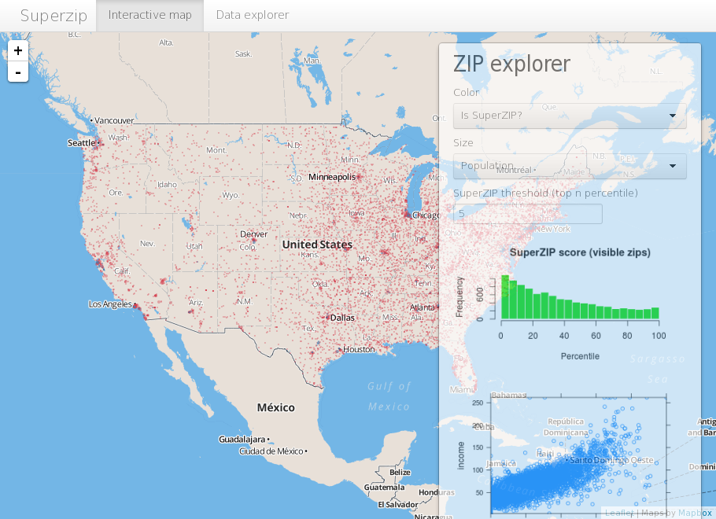

# Shiny

## Shiny

### 
**Qué es Shiny?**

La visualización de datos juega un papel vital en la vida de un Científico de Datos. Es más fácil visualizar datos y relaciones complejas que descifrarlos a partir de hojas de cálculo o de tablas.

Si pensamos en el lenguaje R, existen diversas librerías que permiten de forma más o menos sencilla visualizar los datos de una forma elegante. Tener que hacer, programar, código una y otra vez para generar los gráficos, puede llegar a convertirse ne una tarea agotadora y aburrida. Este tipo de problemas podría solucionarse creando gráficos dinámicos e interactivos. Esta solución la ofrece Shiny.

Shiny es un paquete de R creado en 2012 por Rstudio \(GPLv3\) para desarrollar aplicaciones Web utilizando R. Una de las características más reconocidas de R es que permite hacer excelentes representaciones gráficas, pues Shiny permite crear fácilmente aplicaciones web interactivas \(apps\) que permiten a los usuarios interactuar con sus datos sin tener que manipular el código. No se requieren conocimientos de HTML, JavaScript o CSS para emplear Shiny, solo conocer R.

En la página web [https://shiny.rstudio.com/tutorial/](https://shiny.rstudio.com/tutorial/) se presentan varios tutoriales de uso de Shiny con los siguientes artículos. Lo más importante que el programador debe conocer es lo siguiente:

· Partes básicas de una aplicación Shiny

· Como construir una aplicación Shiny

· Como ejecutar una aplicación Shiny

· Como obtener ayuda

· ….

### **Estructura de una aplicación Shiny**

Las aplicaciones con Shiny tienen dos componentes:

1. **una secuencia de comandos de interfaz de usuario**: la interfaz de usuario \(ui\) controla el diseño y el aspecto de la aplicación: ui.R.

Este archivo crea la interfaz de usuario en una aplicación shiny. Proporciona interactividad a la aplicación tomando la entrada del usuario y mostrando dinámicamente la salida generada en la pantalla.

2. **una secuencia de comandos de servidor:** el script server.R tiene las instruciones que es equipo necesita para construir la aplicación, es decir, contiene la serie de pasos para convertir la entrada dada por el usuario en la salida deseada que se mostrará.

### **Ejecutar una aplicación Shiny**

· Cada aplicación Shiny ten la misma estructura: como mínimo dos scripts de R guardados en el mismo directorio: ui.R y server.R.

· Cada aplicación tendrá su propio directorio único.

· Ejecutar una aplicación Shiny, proporcionando el nombre del directorio a la función runApp.

· Si la aplicación está en el directorio my\_app, se utilizaría el siguiente código:

library\(shiny\)

runApp\("my\_app"\)

Pongamos en práctica el breve esquema anterior:

Lo primero que hay que hacer se no se tiene instalado el paquete es descargarlo de internet, con la siguiente instrucción como cualquiera otro:

install.packages \("shiny" \)

y a continuación lo cargamos:

library\(shiny\)

Como la mayor parte de los paquetes en R, suelen traer una serie de ejemplos de uso del mismo. En este caso el paquete Shiny trae once ejemplos que demuestran como funciona . Y cada uno de ellos es una aplicación Shiny autónoma.

Para crear o configurar una aplicación Shiny desde RStudio los pasos que hay que seguir son los siguientes:

1. Crear un directorio llaamado myapp/ para tu aplicación.

2. Crear un nuevo proyecto en RStudio

3. Seleccione el tipo como aplicación web Shiny

4. Crea dos scripts en RStudio llamados ui.R u server.R.

5. Cada archivo debe codificarse por separado

6. Guardar el script de la aplicacion.R dentro de ese directorio.

7. Iniciar la aplicación con runApp de teclado de runApp o RStudio.

8. Salir de la aplicación Shiny haciendo clic en escape.

### **Publicar la aplicación Shiny en la Web**

Las aplicaciones Shiny creadas para que sean accesibles y usables por cualquiera otra persona tienen que estar implementadas en la web. Puede alojar la aplicación en "[Shinyapps.io](http://www.shinyapps.io/)". Proporciona una plataforma gratuita como servicio \(PaaS\) para el despliegue de aplicaciones Shiny, con algunas restricciones, como solo 25 horas de uso en un mes, espacio de memoria limitado, etc.

Otra posibilidad es emplear un servidor propio para implementar aplicaciones Shiny.

Os pasos para usar Shiny na nube son os siguientes:

1. Registrarse previamente [shinyapps.io](http://www.shinyapps.io/)

2. Ir as Herramientas en RStudio.

3. Abrir las opciones globales.

4. Pestaña de publicación abierta

5. Administrar su cuenta

### **Ventajas y desventajas de Shiny**

Hay muchas otras herramientas de visualización de datos. A continuación se enumeran una serie de **ventajas**:

- Tiempo de respuesta eficiente: el tiempo de respuesta de la aplicación Shiny es muy pequeño, va a depender fundamentalmente del modelo empleado para mostrar los resultados.

- Automatización completa de la aplicación: una aplicación Shiny se puede automatizar para realizar un conjunto de operaciones para producir la salida deseada en función de la entrada.

- No es necesario tener conocimientos de HTML, CSS o JavaScript.

- Pueden emplearse para mostrar datos más complejos como estructuras 3D, mapas, etc.

- Código abierto: Crear y obtener una aplicación Shiny en línea es gratuito, si desea implementar su aplicación en la versión gratuita de [shinyapps.io](http://www.shinyapps.io/)

**Desventajas**:

- Requiere actualizaciones oportunas: las funciones utilizadas en la aplicación a veces se vuelven obsoletas con versiones de paquetes más nuevos, es necesario actualizar la aplicación Shiny cada vez. Pero a esto ya estamos acostumbrados.

- Restricción del tráfico en la versión gratuita: en la versión gratuita de [shinyapps.io](http://www.shinyapps.io/), solo obtiene 25 horas activas de su aplicación por mes por cuenta.

En el siguiente enlace [https://shiny.rstudio.com/articles/cheatsheet.html](https://shiny.rstudio.com/articles/cheatsheet.html) se puede consultar una guía de referencia rápida para crear aplicaciones Shiny con algunos trucos útiles.

