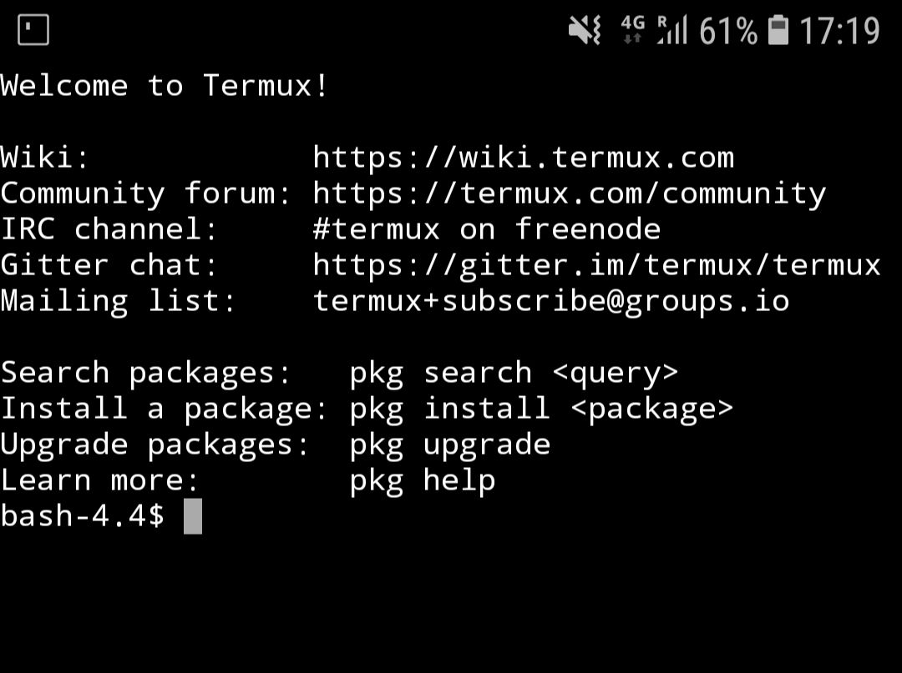
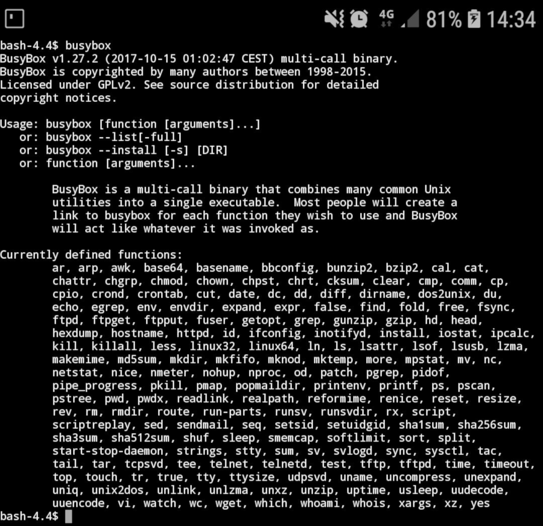
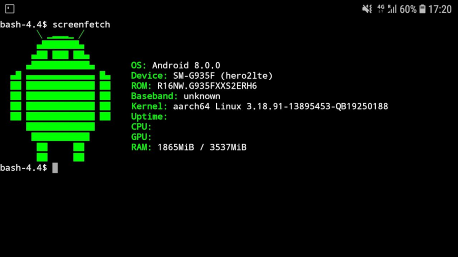
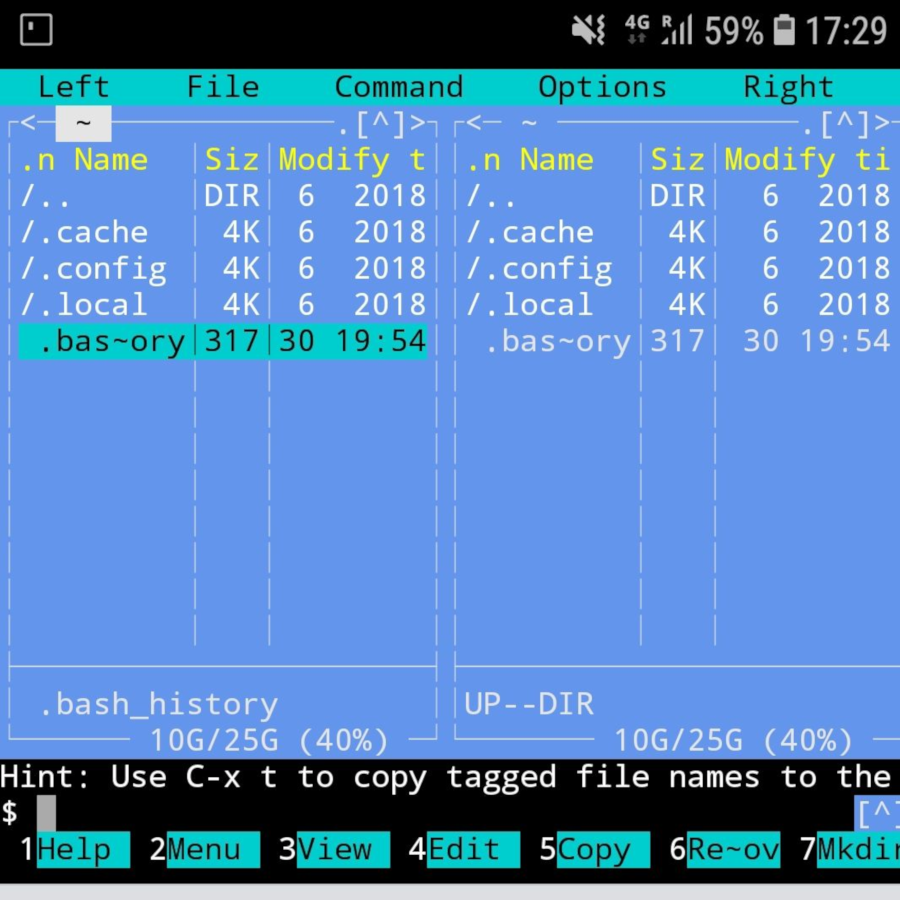
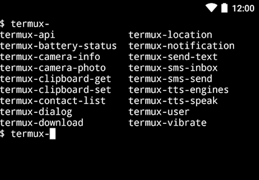

# Termux: Un terminal para gobernarlos a todos

## Termux: Un terminal para gobernarlos a todos

Llamadme viejuno, pero yo no concibo un sistema operativo en el que no poder escribir sobre una terminal de comandos. Las ventajas son muchas, sobre todo si encontramos un emulador de terminal, para Android en este caso, que no necesite de root y que nos permita ampliar su funcionalidad usando el gestor de paquetes APT… Ese es TERMUX \([https://termux.com/](https://termux.com/)\)

Termux es, en definitiva, un emulador de terminal para nuestro Android que nos permitirá , por medio de una shell, la ejecución de comandos Linux.

Para empezar, podemos instalarlo y utilizarlo en nuestro Android sin permisos de superusuario \(root\). En el caso de que no ser superusuarios, debido a las restricciones de acceso de un usuario estándar, no podremos modificar determinados ficheros de Sistema pero eso no será un impedimento para disfrutar de un terminal tremendamente operativo.

Pero empecemos por el principio:

Podemos descargarlo directamente desde Google Play o desde el repositorio de Software Libre F-DROID \(del que ya hemos hablado con anterioridad en esta sección\).

Enlace de Google Play: [https://play.google.com/store/apps/details?id=com.termux](https://play.google.com/store/apps/details?id=com.termux)

Enlace de F-DROID: [https://f-droid.org/packages/com.termux/](https://f-droid.org/packages/com.termux/)

Una vez instalado, tendremos un icono en nuestro dispositivo que nos abre directamente la terminal de comandos.

Basta ejecutar “help” para darnos cuenta de las capacidades de Termux. Por si esto fuera poco, disponemos del conjunto de utilidades que nos proporciona Busybox \([https://busybox.net/](https://busybox.net/)\) la “navaja suiza” de herramientas UNIX para Android. Una multitud de utilidades que nos harán la vida más fácil desde la terminal de comandos.

Mi primer impulso, al leer la información proporcionada al arrancar el terminal, fue ejecutar **apt** para instalar “screenfetch” \[pkg install screenfetch\] y “Midnigth Commander” \[pkg install mc\] … y este es el resultado...

Las posibilidades de Termux son enormes… Podemos instalar Git, Perl, Python, Ruby, Node.js, rsync, OpenSSH, curl, wget, gcc, gnugp, emacs, nano, vim \(aunque trae “vi” preinstalado y listo para utilizar\)… incluso podemos montar un servidor ssh en el propio dispositivo para poder conectarse desde el exterior \(sshd en el puerto 8022\). Además, si observamos que busybox se nos queda “corto” de comandos, podemos instalar coreutils \[pgk install coreutils\].

Para finalizar este breve recorrido por las \(enormes\) capacidades de Termux, hay que mencionar la posibilidad de ampliar su funcionalidad por medio de complementos. Los complementos de Termux son módulos instalables que consiguen dotar de mas funcionalidad a la terminal de comandos.

Sirva como ejemplo **Termux:API**, un complemento que permite, entre otras cosas, acceder a las funciones hardware de Android \(batería, cámara, control de SMS, acceso al GPS, ...\)

Otro interesante es Termux:Boot, que nos permite ejecutar scripts cuando arranca el dispositivo.

En definitiva, Termux es un emulador de terminal de comandos Linux que nos permitirá ampliar el control sobre nuestro dispositivo “a la antigua usanza”. Llamadme viejuno, ahora sí.  
:-\)

